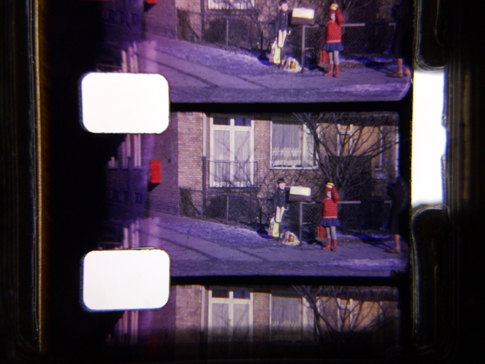
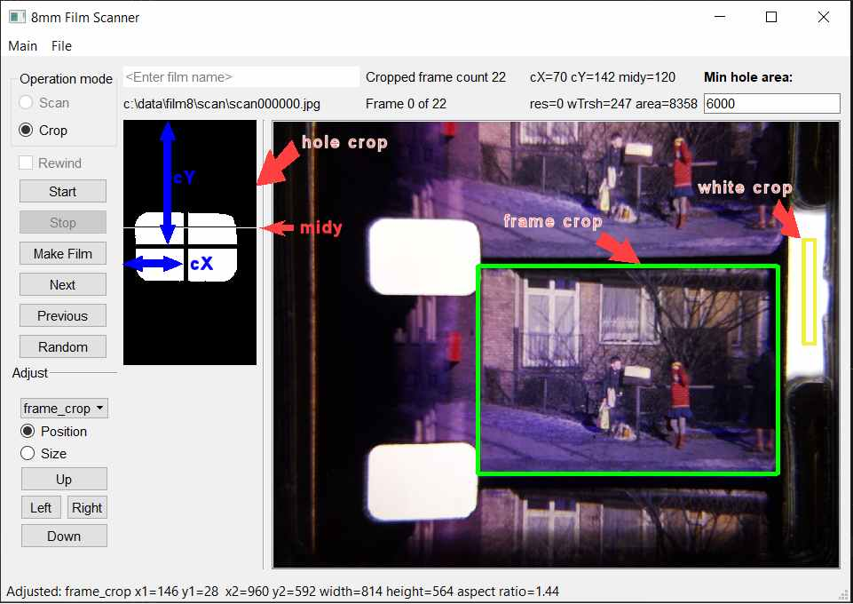

# An alternative App for the Hackaday.io 8mm Film Scanner Project by Anton

 - [Background](#background)
 - [How my version of the scanner software works](#how-my-version-of-the-scanner-software-works)
 - [The Scanner program GUI](#the-scanner-program-gui)
 - [Scanning](#scanning)
 - [Frame crop adjustment](#frame-crop-adjustment)
 - [Cropping all frames](#cropping-all-frames)
 - [Making the Film](#making-the-film)
___
# Background

I followed the very good instructions by @Anton for both the first “[8mm Film Scanner](https://hackaday.io/project/167426-8mm-film-scanner)”, and for the [V2](https://hackaday.io/project/185040-8mm-film-scanner-v2) version with improvements made to the base unit mount plate and film plate.
I 3D printed all parts in PLA. The electronics hardware is Raspberry Pi 4, a Pi Camera 2 and a home-made PCB compatible with Anton’s schematic v1. All other components are as listed by Anton - apart from those used for the control panel and the case. My scanner device is now just a bare version without a case and with no control buttons apart from the power button.

When I first tried to use the scanner with the original Regular 8 software (pi4_R8_scanner.py​) and a mock up control button panel, I experienced that the scanning stopped on some sections of my 60 years old Regular 8mm films. I then adjusted some parameters in the code, added debug and extra views of the sprocket hole area, and tried again (and again ...).

The problems I had were related to the automatic location of the sprocket holes in the film. The control of the process using the push buttons were also not easy for me.

I came to the conclusion that for me it would be better, to have a program with a GUI to control and monitor the scan and crop process.

# Hardware
-    Raspberry Pi 4 Model B Rev 1.5, 8 GB.
-    Anton’s 8mm Film Scanner upgraded to V2 (All parts printed in PLA). Bare bone version without Control Panel and casing.
-   Pi Camera Module 2 with a Sony IMX219 8-megapixel sensor.
-   Home made pcb with components compatible with Anton’s pcb and schematic v1.
-   128 GB Micro SD.
-   12V power-supply for the motors (Using a DC / DC convertor as Anton)
-   Official Raspberry Pi USB-C power supply 5V 3A.

# Software 
This is what I use. Other (newer) versions will probably also work.

Windows 10 PC:
- python 3.9.15
- modules:
  - opencv-contrib-python 4.7.0.68
  - PyQt5 5.9.7
    
Raspberry Pi 4 :
- Buster 64bit
- python 3.9.2
- Python modules
  - OpenCV-4.5.5
  - picamera2 0.3.8
  - PyQt5 5.15.2
  - PyQt5-sip 12.8.1

My program works in python environments as listed above. It consists of four python files:

| File | Use |
| --- | --- |
| Scan8mmFilm_main.py | main program - GUI boilerplate |
| FilmScanModule.py | Frame and Film classes and more - GUI "independent" code |
| piDeviceInterface.py | Raspberry GPIO interface - ignored on Windows |
| Scan8mmFilm_ui.py | GUI build with QtDesigner |

The Scan8mmFilm_ui.py is genrated using the pyuic tool on the ui/Scan8mmFilm_ui.ui that can be edited with the QtDesigner program. See e.g. [here](https://pythonpyqt.com/how-to-install-pyqt5-in-pycharm/)

#  How my version of the scanner software works.
As Anton I chose to use python as programming language. The basic algorithm using OpenCV is still like Anton coded it. For the GUI I chose PyQt5. For interface to the Pi Camera I chose the new picamera2 module.  Here I will explain about 8mm film and how the scanning process works. I must note that I only have worked with Regular 8 film, but I hope that the settings.ini can be adjusted for use with Super 8 film.

On an 8 mm film the individual frames are positioned with a fixed distance to the sprocket holes. A frame sits right in the middle between two holes.

Here is a typical frame scan as seen by my film scanner camera. 

This is the closest view of the film I can get with my setup.  I have set the camera resolution to 1640x1232. The resulting size of a cropped film frame is then about 800x570 pixels.
This is OK for my purpose.

The software tries to position the frame to be scanned centred in the camera view in order to get the best quality. This is done by tracking the position of the upper sprocket hole and moving the film forward or backward. Functionality from the software module OpenCV is used to locate the exact position of the hole. 

When the images are scanned the stepper motor moves the film forward one frame at a time.
The number of steps needed for forwarding one frame is approximately 80 microsteps (Regular 8) when the DRV8825 is set to 80 microsteps/step (M0=1, M1=1, M2=0) as in Anton’s software.
When moving many frames forward a small adjustment is needed from time to time.

## Finding the position of the sprocket hole
The OpenCV function cv2.findContours is used to find the hole position.  Input is an 8-bit image with only two colours black and white. The output is a list of detected contours in the image stored as a vector of points. Another function cv2.contourArea is used to get the pixel area of the located contours. If a contour with an area big enough to be a sprocket hole is found, its center coordinates can be found using the cv2.moments function.

Instead of using the whole picture in this process, the software uses a cropped part of the picture, that is supposed to contain the hole, and converts this to a down sized two-colour image. This saves time, but complicates the position calculation a little. 

The conversion of the sprocket hole crop, to a two-colour image is done by the cv2.threshold function. The function is fed an 8-bit monochrome version of the image and an intensity threshold value. Depending of the film colouration around the hole in the monochrome image, this threshold value is important to set right. The background colour seen trough the hole is white, but due to the automatic Pi camera intensity adjustments, it might be greyish. In order to find the intensity of white hole background I scan an area of the camera view that always is white. Anton’s scanner plate  has a cut-out that serves this purpose perfectly. For each new frame a threshold value is calculated from a small crop in this area. The threshold value is set to a little less than the average intensity in this white crop.

The original scanner software used a fixed threshold, and this caused the sprocket hole calculations to fail on some parts of my Regular 8mm films. Some old Regular 8 cameras tended to expose the whole film. Sometimes false light also caused the film to become very transparent around the holes. 

# The Scanner program GUI
The scanner program can be run on the Raspberry Pi that has the scanner hardware attached or it can be run on a PC. When run on a PC the scan functionality is disabled, but the Crop mode can be used if the Scan Folder contains scanned frames (.jpg files).

## The “scanner.ini” file
When the program is started for the first time a default “scanner.ini” file is created.
This file holds all the available configuration values for the scanner program.

The contents is:

        [paths]
        film_folder = c:\data\film8\film
        scan_folder = c:\data\film8\scan
        crop_folder = c:\data\film8\crop

        [camera]
        view_width = 1640
        view_height = 1232

        [frame]
        hole_min_area = 6000
        midy = 120

        [film]
        resolution = 720x540
        framerate = 12
        steps_pr_frame = 80

        [frame_crop]
        x1 = 146
        x2 = 960
        y1 = 28
        y2 = 592

        [white_crop]
        x1 = 562
        x2 = 574
        y1 = 125
        y2 = 235

        [hole_crop]
        x1 = 90
        x2 = 240
        y1 = 0
        y2 = 276

Many of the settings can be adjusted using the GUI: 
- all the folder paths - by using the File menu
- all the crop definitions
- [frame] hole_min_area

The rest of the settings should be fixed for a given scanner device and film type.

- [film] resolution – is given directly to the ffmpeg program and defines the resolution of the .mp4 film.
- [film] fps – is also given directly to the ffmpeg program and defines the frame rate.
All values can be changed manually by editing the “scanner.ini” file. Make sure that the program is stopped when you edit.

# Scanning 
When Operation mode is set to Scan the big image shows a live video stream from the scanner camera. 
The Next and Previous buttons moves the film one frame forward or backward.
The Up and Down buttons adjusts the frame up or down allowing you to check, if the hole can be aligned with the midy line.

If no frames has been scanned yet, it might be necessary to adjust the different crop settings.
Push Start and let the device scan a few frames and then push Stop. Now switch to Crop mode to do the adjusting.
When the crops has been adjusted clear the Scan folder (File / Clear Scan Folder) and switch to Scan mode and push Start.
During scanning the hole_crop image and position information will be updated for visual inspection.
The scanner stores the frames named as “scanNNNNNN.jpg” where NNNNNN is a zero prefixed 6 digit frame number e.g. “scan000008.jpg”
 
## Adjusting  settings in Crop mode
Shown below is a screenshot of the Scanner GUI in Crop Mode.

The Next, Previous and Random buttons can be used to check, if the frame crop fits on various parts of the film.

In this mode it is possible to adjust various scanner settings:

The input field “Min hole area” defines the minimum area in pixels, that an area must have in order to be considered a hole. With my setup a hole is around 8500 pixels and 6000 is a safe value.

In the Adjust group the different crops from the camera view can be adjusted by position or size. When the Size radio button is selected it is the lower and left side of the crop that is adjusted.

The combo box is used to select the crop to be adjusted:
 
# Film frame crop adjustment
When “frame_crop” is selected it is possible to adjust the position and size of the film frame crop. The position is relative to the center of the upper sprocket hole. The values are used to crop from the raw scan image.

## Sprocket hole crop adjustment
When “hole_crop” is selected is possible to adjust the position and size of the sprocket hole crop.
The crop is shown as a black/white image to the left of the camera view, The crop is taken from the top left side of the camera view. The crop should be a little distance from the left film edge, start from the top of the view and be sized to enclose the upper hole in the wanted position.  The values are used to crop from the scan image resized to 640x480.

## White area crop adjustment
When “white_crop” is selected is possible to adjust the position and size of the white area crop.
The crop should be taken from the always white area of the camera view. Do not make the crop to close to the right edge of the film. The film tends to move a little from side to side. The values are used to crop from the scan image resized to 640x480.

# Cropping all frames
In Crop mode the Start button initiates the automatic cropping of all the frames in the scan folder. The files are sorted by name and are processed in that order. 
When the frames are cropped the x and y position of the crop is recalculated for each frame.
This ensures that the frame is cropped correctly relative to the hole center.

The cropped frames are renumbered and saved in the crop folder with a name of the form "frameNNNNNN.jpg"​. Where NNNNNN is a zero prefixed 6 digit frame number. 

The film making process expects that the frames are sequentially numbered​.

# Making the Film
When all the frames has been cropped the film can be made.

Give the film a name in the Input field at the top and push the make Film button.

The progam calls the ffmpeg program ​and the resulting .mp4 video is stored in the film folder. All output from the ffmpeg program is directed to the scanner window for inspection. Use the scrollbar to reach the final output line.

